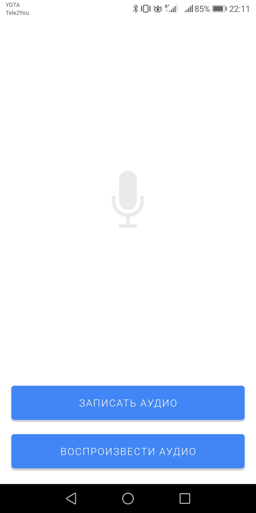
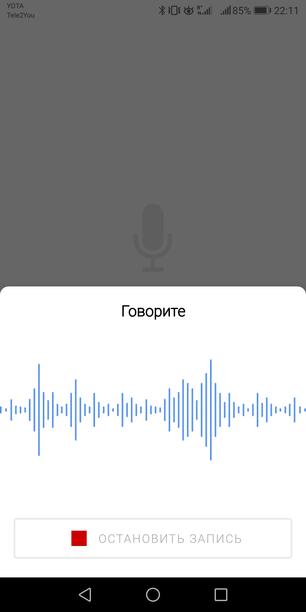
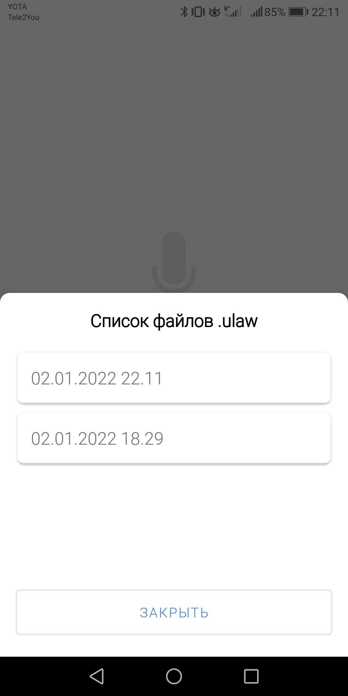

# Dictaphone for Android (test project)    

Приложение представляет собоой диктофон с использованием аудикодека [G711.u] (PCM-ulaw).

[G711.u]: https://ru.wikipedia.org/wiki/G.711

## Описание тестового задания 

1. Кнопка “Записать аудио”, при нажатии на которую:
   * Должно появляться окно с текстом “Говорите” и кнопкой “Остановить запись”;
   * Приложение должно записывать звук с микрофона устройства в файл на устройстве.

2. Кнопка “Воспроизвести аудио”, при нажатии на которую:
   * Должно появляться окно со списком файлов, записанных ранее;
   * При выборе файла из списка он должен начать воспроизводиться через динамик устройства.

3. Формат записываемого файла - G711.u (PCM-ulaw).

## Скриншоты

| Главынй экран                                   | Окно для записи                                 | Окно со списоком файлов                         |
| :---------------------------------------------: | :---------------------------------------------: | :---------------------------------------------: |
|  |  |  |
   

## Контакты 

 
